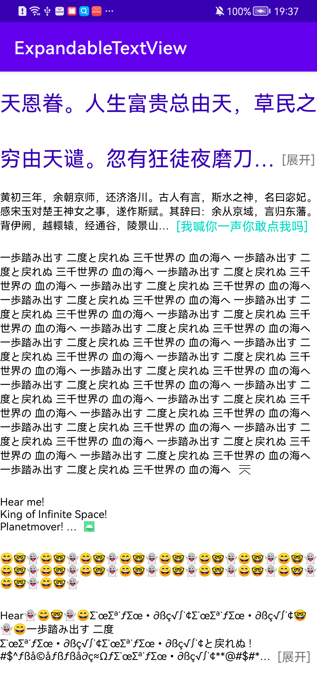

# ExpandableTextView

这是一个支持设置最大行数的控件。当文字超过最大行数时，将自动折叠文字，并在末尾展示“展开”按钮。用户可以点击展开或折叠内容。

これは最大行数を設定できるビューです。テキストが設定した行数を超えると、自動的に折りたたまれ、末尾に「もっと見る」ボタンが表示されます。ユーザーはクリックしてテキストを展開・折りたたむことができます。

This is a view that supports setting a maximum number of lines. When the text exceeds the specified line limit, it will be automatically collapsed, and an "Expand" button will appear at the end. Users can tap to expand or collapse the text.

non-Chinese translations provided by ChatGPT. Please feel free to suggest improvements via PR.

下面是截图，具体用法见MainActivity

> 

反正没人看，README就随便写写了，立个flag，超过50个star就把README好好写写
