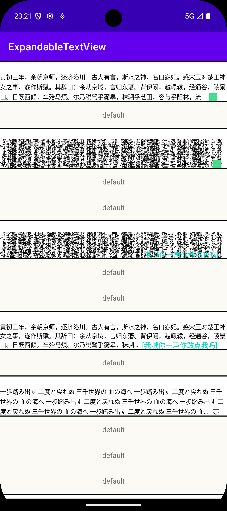

# ExpandableTextView

这是一个支持设置最大行数的控件。当文字超过最大行数时，将自动折叠文字，并在末尾展示“展开”按钮。用户可以点击展开或折叠内容。

'展开/收起'按钮支持自定义

下面是截图，具体用法见MainActivity

> 

## 如何使用

XML中
配置一段文字作为'展开/收起'按钮
```xml
    <com.jiaoay.expandabletextview.widget.ExpandableTextView
        android:layout_width="match_parent"
        android:layout_height="wrap_content" />
```

当然也支持加入一些自定义的'展开/收起'按钮, 支持配置文字颜色等内容
```xml
    <com.jiaoay.expandabletextview.widget.ExpandableTextView
        android:layout_width="match_parent"
        android:layout_height="wrap_content">

        <com.jiaoay.expandabletextview.widget.ExpandableText
            android:id="@+id/expandableText"
            android:layout_width="wrap_content"
            android:layout_height="wrap_content"
            app:expandTextColor="@color/teal_200"
            app:foldTextColor="@color/purple_200" />
    </com.jiaoay.expandabletextview.widget.ExpandableTextView>
```

配置一个icon作为'展开/收起'按钮
```xml
    <com.jiaoay.expandabletextview.widget.ExpandableTextView
        android:id="@+id/text"
        android:layout_width="match_parent"
        android:layout_height="wrap_content"
        android:layout_marginTop="20dp"
        app:lineSpacingExtra="2dp">

        <com.jiaoay.expandabletextview.widget.ExpandableIcon
            android:id="@+id/expandableIcon"
            android:layout_width="wrap_content"
            android:layout_height="15dp"
            android:scaleType="centerInside" />
    </com.jiaoay.expandabletextview.widget.ExpandableTextView>
```