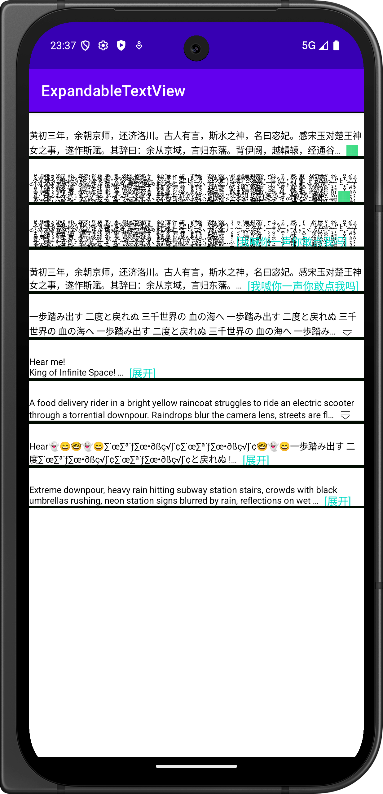
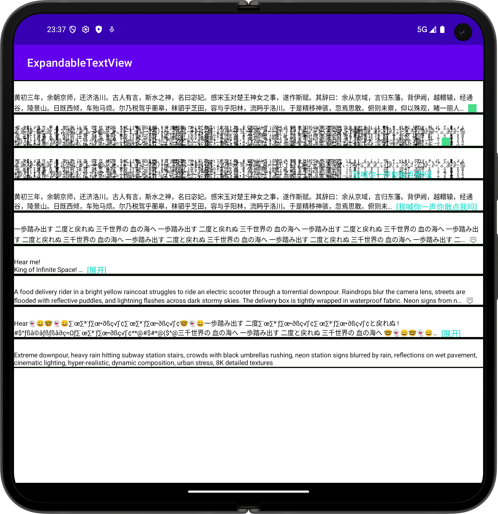

# ExpandableTextView

一个支持展开/收起的 Android 自定义控件。当文字超过最大行数时自动折叠，并在末尾显示展开按钮；点击后可切换展开与收起状态。

**展开/收起按钮** 支持两种形式：
- 🖼️ **图标按钮** (`ExpandableIcon`) — 使用自定义 Drawable
- 🔤 **文字按钮** (`ExpandableText`) — 使用自定义文字与颜色

| 图标按钮 | 文字按钮 |
|---|---|
|  |  |

---

## 环境要求

- `minSdk` 23
- `compileSdk` / `targetSdk` 37

---

## 基本用法

### 1. 纯默认样式（无子 View）

```xml
<com.jiaoay.expandabletextview.widget.ExpandableTextView
    android:layout_width="match_parent"
    android:layout_height="wrap_content"
    app:maxExpandLine="3" />
```

### 2. 文字按钮（ExpandableText）

```xml
<com.jiaoay.expandabletextview.widget.ExpandableTextView
    android:id="@+id/expandableTextView"
    android:layout_width="match_parent"
    android:layout_height="wrap_content"
    app:maxExpandLine="3">

    <com.jiaoay.expandabletextview.widget.ExpandableText
        android:id="@+id/expandableText"
        android:layout_width="wrap_content"
        android:layout_height="wrap_content"
        app:expandText="[展开]"
        app:expandTextColor="@color/teal_200"
        app:foldText="[收起]"
        app:foldTextColor="@color/purple_200" />
</com.jiaoay.expandabletextview.widget.ExpandableTextView>
```

### 3. 图标按钮（ExpandableIcon）

```xml
<com.jiaoay.expandabletextview.widget.ExpandableTextView
    android:id="@+id/expandableTextView"
    android:layout_width="match_parent"
    android:layout_height="wrap_content"
    app:lineSpacingExtra="2dp"
    app:maxExpandLine="3">

    <com.jiaoay.expandabletextview.widget.ExpandableIcon
        android:id="@+id/expandableIcon"
        android:layout_width="wrap_content"
        android:layout_height="15dp"
        android:scaleType="centerInside"
        app:expandIcon="@drawable/ic_expand_down"
        app:foldIcon="@drawable/ic_fold_up" />
</com.jiaoay.expandabletextview.widget.ExpandableTextView>
```

---

## Kotlin 调用

```kotlin
// 设置文字，可选初始展开状态与状态回调
expandableTextView.setText(
    text = "这是一段很长的内容...",
    isExpanded = false
) { isExpanded ->
    // 展开/收起状态变化回调
}

// 支持 SpannableString 富文本
expandableTextView.setText(
    text = buildSpannableWithLinks()
)

// 设置图标按钮资源
expandableIcon.setExpandableIcon(
    expandIconResource = R.drawable.ic_expand_down,
    foldIconResource = R.drawable.ic_fold_up
)

// 设置文字按钮内容
expandableText.setExpandableText(
    expandText = "查看更多",
    foldText = "收起"
)
```

---

## 属性参考

### ExpandableTextView

| 属性 | 类型 | 说明 |
|---|---|---|
| `app:maxExpandLine` | integer | 折叠时最大显示行数 |
| `app:expandedIconMarginLeft` | dimension | 展开按钮与文字末尾的间距 |
| `app:lineSpacingExtra` | dimension | 行间距（额外值） |
| `app:lineSpacingMultiplier` | float | 行间距（倍数） |
| `app:textColor` | color | 正文文字颜色 |
| `app:textSize` | dimension | 正文文字大小 |

### ExpandableIcon

| 属性 | 类型 | 说明 |
|---|---|---|
| `app:expandIcon` | reference | 折叠状态下显示的图标 |
| `app:foldIcon` | reference | 展开状态下显示的图标 |

### ExpandableText

| 属性 | 类型 | 说明 |
|---|---|---|
| `app:expandText` | string | 折叠状态下显示的文字（默认 `展开`） |
| `app:expandTextColor` | color | 展开按钮文字颜色 |
| `app:foldText` | string | 展开状态下显示的文字（默认 `收起`） |
| `app:foldTextColor` | color | 收起按钮文字颜色 |
